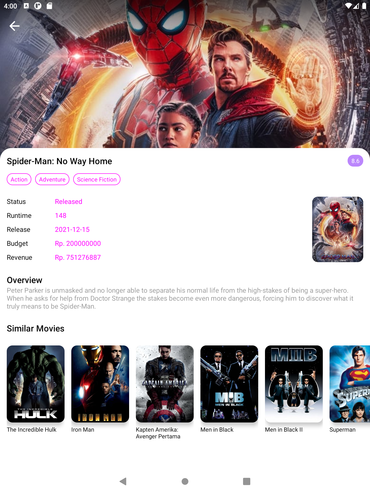

# instamovie
Jetpack compose exploration instagram clone

# Screenshot Mobile

    
    
    

# Screenshot Tablet

    
    
    

# Library used in this project
[Retrofit](https://github.com/square/retrofit)\
[Okhttp](https://github.com/square/okhttp)\
[Coil](https://github.com/coil-kt/coil)\
[Landscapist](https://github.com/skydoves/Landscapist)\
[System UI Controller](https://github.com/google/accompanist/tree/main/systemuicontroller)\
[Pager](https://github.com/google/accompanist/blob/main/pager)\
[Insets](https://github.com/google/accompanist/tree/main/insets)\
[Navigation Animation](https://github.com/google/accompanist/tree/main/navigation-animation)\
[Gson](https://github.com/google/gson)\
[Room Database](https://developer.android.com/jetpack/androidx/releases/room)\

# REST API Source
[The Movie DB API](https://www.themoviedb.org/documentation/api)